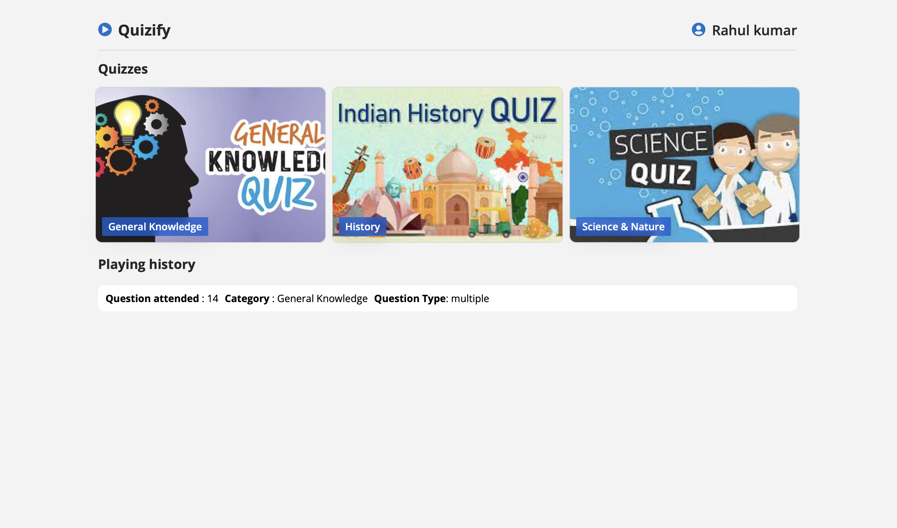
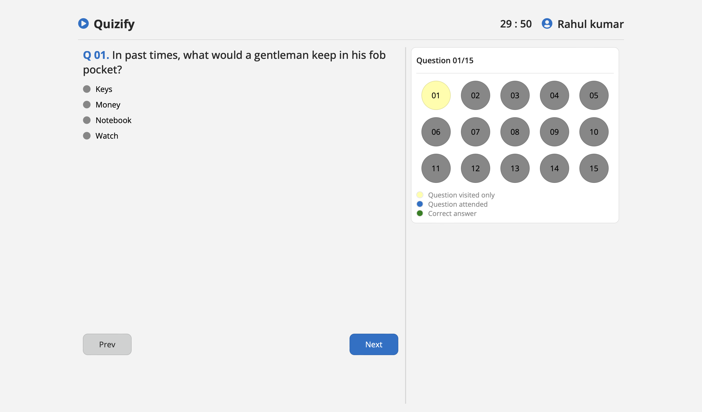
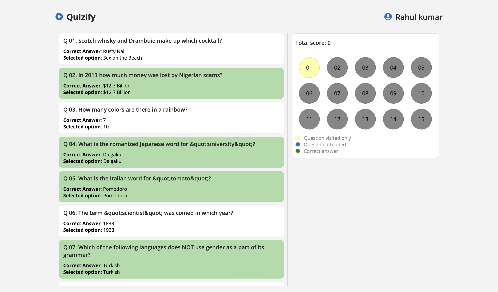

# [Quizify](https://quizify-by-pritam.netlify.app/)

### It's an app where you can play lots of fun quizzes. It doesn't matter if you're a quiz pro or just looking to have some fun.

## Planing before building

[Link](https://excalidraw.com/#json=ZBLID5QATKE6gaVJLCrzO,GXb5_UwkmvuEyekDCWjqAg)

## Tech stack

- ReactJs
- SCSS
- Redux

## Key Features

- Users can do simple login using name and email.
- Multiple choise question with timer feature
- Users can see status for question attended, visited, and correct answer.
- Playing history of attened quizs
- Quizs on General knowladge, hisory and science

## Getting Started

Follow these steps to run Quizify on your machine:

- Clone the repository: git clone https://github.com/pritam-kr/quiz.git
- Install dependencies: npm install
- Start the development server: npm start
- Open your web browser and go to http://localhost:3000 to access the website.

## Pages

### Login

### Home

### Question

### Report

# Contact
If you have any questions or suggestions, please feel free to reach out to me at pritamvr9@gmail.com